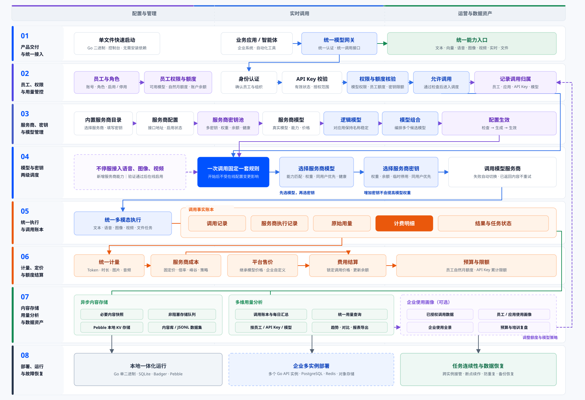
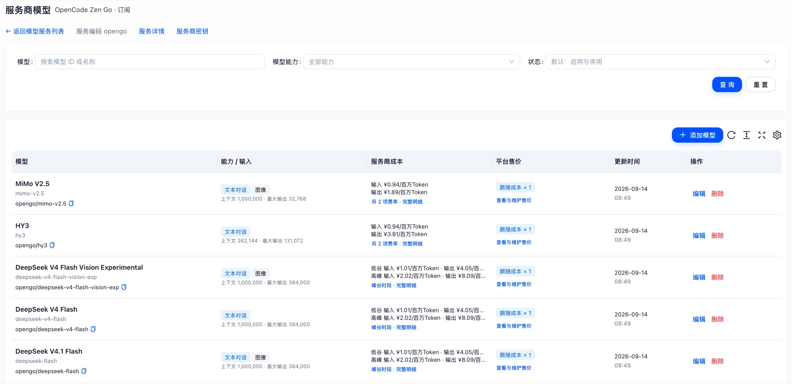
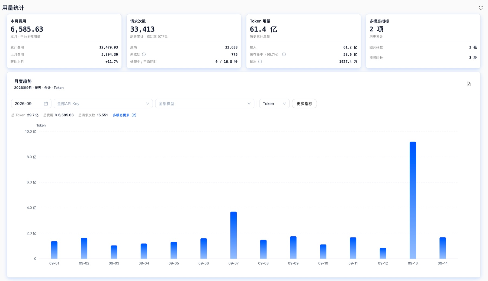
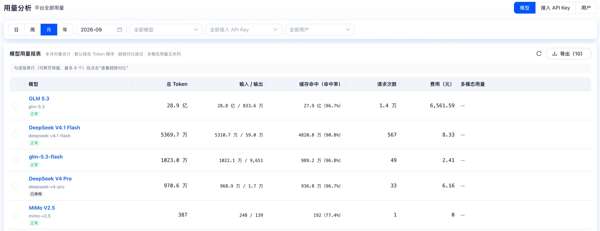

# 智匣·融智（AI Slate）

智匣·融智（AI Slate）是一款开箱即用的多模型服务管理平台。下载对应平台版本即可在本机启动，通过浏览器统一接入和调度多家模型服务商的文本、图像、语音与视频模型，并集中查看调用记录、用量与成本。

**[在线体验](https://demo.local.llmslate.com/)** · **[下载安装包](https://github.com/ai-slate/ai-slate-local-zh/releases)**



---

## 在线体验与下载

**先在线体验（当前推荐）：** 无需下载或安装，用浏览器直接打开共享演示环境，先看服务商与模型管理、调用记录和用量分析：

<https://demo.local.llmslate.com/>

演示环境的用户名和密码已经预填，打开页面后填写页面上的图片验证码即可登录。

> **在线体验是共享演示环境。** 请只输入演示数据：不要填写真实 API Key、真实业务内容、客户数据或个人敏感信息。

**下载安装包：** 在 GitHub Releases 获取与你的系统匹配的安装包；平台运行数据保存在你指定的本地运行目录：

<https://github.com/ai-slate/ai-slate-local-zh/releases>

需要查看版本说明或历史版本时，也进入上面的 Releases 页面。

当前版本：**v3.1.0**（安装包和程序内部版本号为 `3.1.0`）。所有正式安装包只通过 GitHub Releases 分发。

| 你的电脑 | 选择目标 | 直接下载 |
|---|---|---|
| 普通 64 位 Intel/AMD Linux | `linux-amd64` | [`ai-slate-local-3.1.0-linux-amd64.tar.gz`](https://github.com/ai-slate/ai-slate-local-zh/releases/download/v3.1.0/ai-slate-local-3.1.0-linux-amd64.tar.gz) |
| ARM64 Linux（如 ARM 服务器） | `linux-arm64` | [`ai-slate-local-3.1.0-linux-arm64.tar.gz`](https://github.com/ai-slate/ai-slate-local-zh/releases/download/v3.1.0/ai-slate-local-3.1.0-linux-arm64.tar.gz) |
| 64 位 Windows | `windows-amd64` | [`ai-slate-local-3.1.0-windows-amd64.zip`](https://github.com/ai-slate/ai-slate-local-zh/releases/download/v3.1.0/ai-slate-local-3.1.0-windows-amd64.zip) |
| Intel 芯片的 Mac | `darwin-amd64` | [`ai-slate-local-3.1.0-darwin-amd64.tar.gz`](https://github.com/ai-slate/ai-slate-local-zh/releases/download/v3.1.0/ai-slate-local-3.1.0-darwin-amd64.tar.gz) |
| Apple 芯片（M 系列）的 Mac | `darwin-arm64` | [`ai-slate-local-3.1.0-darwin-arm64.tar.gz`](https://github.com/ai-slate/ai-slate-local-zh/releases/download/v3.1.0/ai-slate-local-3.1.0-darwin-arm64.tar.gz) |

表中的包名和链接固定对应当前版本；下方[校验与解压](#校验与解压)的命令用 `${VERSION}` 作为版本变量，Windows PowerShell 中写作 `$Version`。判断方法：

- macOS：在“关于本机”中查看芯片类型；Apple 芯片选 `darwin-arm64`，Intel 选 `darwin-amd64`。
- Linux：`uname -m` 输出 `x86_64` 选 `linux-amd64`，输出 `aarch64` 或 `arm64` 选 `linux-arm64`。
- Windows：选择 `windows-amd64`。

无论选择哪个平台包，都请同时下载同一版本的 [`SHA256SUMS`](https://github.com/ai-slate/ai-slate-local-zh/releases/download/v3.1.0/SHA256SUMS)，并按[校验与解压](#校验与解压)完成校验。

每个压缩包解压后只有一个顶层目录，固定包含八个文件：

- 目标平台的 `slate`（Windows 为 `slate.exe`），以及 `start`、`stop`、`upgrade` 三个脚本（Linux/macOS 为 `.sh`，Windows 为 `.cmd`）
- `README.zh-CN.md`、`RELEASE.json`、`SHA256SUMS`
- `LICENSE.md`（本软件的专有许可；使用和转移安装包时请一并保留）

包内 `SHA256SUMS` 校验的是除它自身以外的七个文件。

> **macOS v3.1.0 首次启动提示：** 当前 macOS 安装包尚未提供受信任的 Developer ID 签名和 Apple 公证。完成 SHA-256 校验后，如果系统提示“Apple 无法检查是否包含恶意软件”，请按 [macOS 首次启动被 Gatekeeper 拦截](#macos-首次启动被-gatekeeper-拦截)手动确认。不要删除隔离属性或全局关闭 Gatekeeper。

---

## 统一入口支持的模型能力

智匣·融智把已接入并达到可用状态的以下模型能力纳入统一网关。实际可调用范围以你配置的服务商、密钥、网络、余额和权限为准，接入后可通过一次最小真实调用完成确认。

| 能力 | 说明 |
|---|---|
| 文本生成 | 支持 OpenAI Responses、OpenAI Chat Completions、Anthropic Messages 三种独立协议 |
| 文本嵌入 | 文本向量化 |
| 图像 | 图像生成与图像编辑 |
| 语音 | 语音识别、文字转语音、音频生成 |
| 视频 | 视频生成、异步状态查询、取消与结果下载 |

统一的是**网关入口、API Key 认证、模型选择、服务商密钥调度、调用生命周期、用量、计价和文件生命周期**；不同能力沿用各自明确的请求格式，文本生成的三种协议分别保持与对应生态兼容的字段结构。

在文本生成之上，智匣·融智还支持 **Claude Code、Codex、OpenCode** 三类 Coding Agent 接入，可以作为它们的统一模型入口：Claude Code 使用 Anthropic Messages，Codex 使用 OpenAI Responses，OpenCode 使用 OpenAI-compatible Chat Completions。三套工具进入同一套 API Key 认证、模型选择、调度、用量与计价体系；具体配置与验证步骤见产品内“在线接入文档”的“Coding Agent 接入”。

---

## 它解决什么问题

当项目同时使用多家服务商、多把密钥和多种模型能力时，接入、重试、计费、排错和记录容易散落在业务代码、脚本与表格中。

智匣·融智把这些工作收进一个可核对的管理入口：

- **两级调度与故障切换**：一次调用先选择服务商模型，再从该模型绑定的密钥中选择一把，两层可以分别设置权重。某把密钥欠费时可以换到同模型的其他密钥；某个模型或整家服务商异常时可以绕开对应候选。流式调用只在首个上游内容到达前、并且能够确认请求未发出或被明确拒绝时切换，以避免产生结果未知的重复调用与重复扣费。
- **单次调用证据**：每次请求被记成一条可对齐的账——调用、真实发生的每一次尝试、上游返回的原始用量和对应费用明细。调用了谁、用了哪把密钥、消耗了多少、为什么扣费、在哪一步失败，都能在同一条记录里查到。
- **成本分层与分析**：服务商成本、平台售价、用户实际扣费三层分开记录，各有口径；定价可以在调用发生时冻结，之后改价、重启或跨时段都不会重算已发生的账。在这套账之上，用量可按用户、API Key、模型、任务和时间观察，并支持导出。
- **本地数据与恢复能力**：平台的全部可变运行数据集中在启动时选择的运行目录，支持自检、诊断包、加密备份、备份校验、原地恢复、回滚收尾和从新解压目录升级。

---

## 开始前准备

- **匹配的平台包**：用上文的平台表，选出与操作系统和 CPU 架构一致的包。
- **可写的运行目录**：默认 `$HOME/.slate`；如果该位置不可写，用 `--runtime-dir` 指向一个有写权限的目录。
- **可用的默认端口**：默认监听 `0.0.0.0:18084`；端口被占用时用 `--port` 换一个端口。
- **产品运行许可证**：与部署 ID 绑定的技术授权凭证，可在首次进入安装向导时在线领取，或从发行方取得后手动导入（见“完成四步初始化”）。
- **一个可用的服务商账号与密钥**，以及能访问该服务商的网络。

当前公开发布的安装包采用自包含的单一程序，不需要预装 Go、Node、Yarn、Make 或外部数据库。

---

## 校验与解压

下载完成后，先校验压缩包本身，再解压，最后校验包内文件。请把 `VERSION` 和 `TARGET` 改成你的版本和目标。

**Linux：**

```bash
VERSION=3.1.0
TARGET=linux-amd64            # 按上表替换为你的目标
PKG="ai-slate-local-${VERSION}-${TARGET}.tar.gz"

# 1) 校验下载的压缩包
sha256sum "$PKG"
# 将输出与同一版本 Release 的根 SHA256SUMS 中同名文件的一行比较

# 2) 解压
tar -xzf "$PKG"
cd "ai-slate-local-${VERSION}-${TARGET}"

# 3) 校验包内除 SHA256SUMS 自身外的七个文件
sha256sum -c SHA256SUMS
```

**macOS：**

```bash
VERSION=3.1.0
TARGET=darwin-arm64           # Intel Mac 改为 darwin-amd64
PKG="ai-slate-local-${VERSION}-${TARGET}.tar.gz"

# 1) 校验下载的压缩包（macOS 自带 shasum，没有 sha256sum）
shasum -a 256 "$PKG"
# 将输出与同一版本 Release 的根 SHA256SUMS 中同名文件的一行比较

# 2) 解压
tar -xzf "$PKG"
cd "ai-slate-local-${VERSION}-${TARGET}"

# 3) 校验包内除 SHA256SUMS 自身外的七个文件
shasum -a 256 -c SHA256SUMS
```

**Windows PowerShell：**

```powershell
$Version = '3.1.0'
$Target  = 'windows-amd64'
$Package = "ai-slate-local-$Version-$Target.zip"

# 1) 校验下载的压缩包
Get-FileHash ".\$Package" -Algorithm SHA256
# 将 Hash 与同一版本 Release 的根 SHA256SUMS 中同名文件的一行比较

# 2) 解压并进入目录
Expand-Archive ".\$Package" -DestinationPath .
Set-Location ".\ai-slate-local-$Version-$Target"

# 3) 逐文件校验包内除 SHA256SUMS 自身外的七个文件
Get-Content .\SHA256SUMS | ForEach-Object {
  $parts = $_ -split '  ', 2
  if ((Get-FileHash -LiteralPath $parts[1] -Algorithm SHA256).Hash.ToLower() -ne $parts[0]) { throw "校验失败：$($parts[1])" }
}
"全部文件校验通过"
```

校验失败时不要继续运行，请重新下载或联系发行方。

---

## 第一次启动

进入解压后的目录，先自检，再启动。

**Linux / macOS：**

```bash
chmod 0755 ./slate ./start.sh ./stop.sh ./upgrade.sh
./slate self-check
./start.sh
# 等价写法：./slate start
```

**Windows PowerShell / CMD：**

```powershell
.\slate.exe self-check
.\start.cmd
# 等价写法：.\slate.exe start
```

### macOS 首次启动被 Gatekeeper 拦截

通过浏览器下载后，第一次执行 `./slate self-check` 时，macOS 可能提示“Apple 无法检查‘slate’是否包含恶意软件”，并显示“移到废纸篓”按钮。

只有在安装包和包内文件都已按[校验与解压](#校验与解压)通过 SHA-256 校验，并且警告内容确实是“Apple 无法检查是否包含恶意软件”或“无法验证开发者”时，才按以下步骤为这个文件添加一次例外：

1. 在终端执行一次 `./slate self-check`，出现提示后选择“完成”或关闭提示，不要移到废纸篓。
2. 打开 macOS“系统设置”，进入“隐私与安全性”，向下滚动到“安全性”。
3. 找到刚刚被阻止的 `slate`，点击“仍要打开”。这个按钮通常只在尝试启动后的一段时间内显示。
4. 输入当前 Mac 的登录密码；警告再次出现时，确认文件名无误，然后点击“打开”。
5. 回到终端重新执行 `./slate self-check`；通过后再执行 `./start.sh`。

这个操作只为当前 `slate` 文件保存安全例外，不会全局关闭 Gatekeeper。完整的系统操作和风险说明见 [Apple 官方文档：在 Mac 上安全地打开 App](https://support.apple.com/zh-cn/102445)。

> **遇到以下任一情况时不要继续：** SHA-256 校验失败；提示内容是“将损坏你的电脑”“包含恶意软件”或“App 已损坏”；文件已经被系统自动移到废纸篓。请删除当前下载内容，从本仓库 GitHub Releases 重新下载并再次校验；问题仍然存在时请提交反馈。不要使用网上流传的 `xattr` 删除隔离属性，也不要全局关闭 Gatekeeper。

`self-check` 会检查内嵌资源、产品模式和许可证公钥，确认文件完整后才会继续。

`start` 默认在后台运行，默认运行目录为 `$HOME/.slate`，默认监听 `0.0.0.0:18084`。启动后直接打开下面的管理页面地址；首次使用会自动进入安装向导，无需特殊链接、Cookie 或额外授权。服务已经运行时再次执行启动命令不会重复启动，也不会清空数据。

启动后访问（使用自定义地址时以启动提示为准）：

- 管理页面与安装向导：<http://127.0.0.1:18084/>
- Swagger API 文档：<http://127.0.0.1:18084/swagger/index.html>
- OpenAPI 文档：<http://127.0.0.1:18084/openapi.json>

需要自定义运行目录、监听地址或端口时，在第一次启动前指定：

```bash
./slate start ./runtime --host 0.0.0.0 --port 18084
# 等价写法：./slate start --runtime-dir ./runtime --host 0.0.0.0 --port 18084
```

> **运行目录一旦投入使用，后续所有命令都必须指向同一个目录。** 不要同时启动两个指向同一运行目录的进程。运行时可通过 `--foreground` 在终端前台观察日志，通过 `--no-open` 禁止自动打开浏览器。不要同时使用位置参数和 `--runtime-dir`。

---

## 完成四步初始化

用任意浏览器打开普通访问地址（程序会在交互终端尝试自动打开浏览器；没有自动打开时手动访问即可）。首次使用会进入安装向导，依次完成四步：

1. **验证许可证**：页面会显示部署 ID（Deployment ID）。支持自动领取的安装包可输入图片验证码在线领取，使用者名称选填、只作备注。自动领取失败、网络不可用或没有领取入口时，把“部署 ID”发送给发行方，收到许可证后点击“手动导入”，上传文件或粘贴完整内容即可继续；手动导入仍会在本机校验签名、部署绑定和有效期。此步不会创建管理员，也不会保存许可证。
2. **创建管理员**：设置用户名、显示名称和密码，并确认对外 API 地址、API 密钥数量上限与内容保存设置。保存成功后自动建立本次管理员登录态。
3. **接入模型服务**：选择服务商、接入方式与模型，填写服务商密钥。内置目录模型默认全选，可以调整、手动补充或添加多个服务；也可以选择稍后配置。
4. **完成**：查看实际配置结果后进入平台。未接入服务商时安装仍可完成，但接入模型前不能调用。

初始化说明：

- 服务商配置失败不会撤销已创建的管理员或其他已保存服务。刷新、网络中断或未获得登录态时，请使用已创建的管理员正常登录后继续；重复提交安装请求不会重新发放 Token 或覆盖管理员。
- 未保存的密码和服务商密钥在刷新后需要重新输入，不会作为向导草稿持久保存。
- 许可证签发私钥只应由发行方保存，安装包内不会包含私钥。许可证到期或不匹配时，普通业务和新的模型调用会暂停，但管理页面、登录、Swagger、产品信息和许可证更换入口仍然可用。

---

## 首次验证

初始化完成后，建议按下面的顺序做一次最小验证，确认从界面到调用的链路真实可用：

1. 在管理页面的服务商/模型配置中，对已接入的服务商执行一次**在线验证或最小真实调用**，确认密钥、网络、余额和权限都可用。
2. 打开**调用记录**，找到刚才这次请求，确认它记录了服务商、模型、使用的密钥、真实尝试、上游返回用量、费用明细和错误信息（如有）。
3. 打开**用量与分析**，确认这次调用的次数、计量项和金额已经进入统计，并且可以按用户、API Key、模型等维度查看。
4. 在终端核对实际运行的构建身份：

```bash
./slate version --json   # Windows：.\slate.exe version --json
```

把输出与对应版本下载包的 `RELEASE.json` 对照版本、目标平台和 Bundle 摘要；文件 SHA-256 用平台校验命令与该包记录比较。

---

## 从你的程序调用

在管理页面的 **API Key 管理**中创建一个“调用 API Key”（页面只展示掩码，点击复制后完整值会写入剪贴板）。然后把网关基址和这个 Key 配到环境变量里：

```bash
export AI_SLATE_BASE_URL="http://127.0.0.1:18084/gateway/llm/v1"
export AI_SLATE_API_KEY="<你的调用 API Key>"
```

先确认 Key 可用，并查看当前可调用的能力：

```bash
curl -sS "$AI_SLATE_BASE_URL/capabilities" \
  -H "Authorization: Bearer $AI_SLATE_API_KEY"
```

在返回列表里选择一个 `readiness.ready=true` 的模型，再发起一次最小文本请求（把 `your-chat-model` 换成上一步选出的模型代码）：

```bash
curl -sS "$AI_SLATE_BASE_URL/responses" \
  -H "Authorization: Bearer $AI_SLATE_API_KEY" \
  -H "Content-Type: application/json" \
  -H "Idempotency-Key: first-call-0001" \
  -d '{"model":"your-chat-model","input":"请只回复：接入成功","stream":false}'
```

上面的 Key 和模型都是占位示例，请不要把真实秘密写进脚本或提交到 Git。Chat Completions、Anthropic Messages 以及图像、语音、视频的字段、响应和错误处理，见管理页面内的“接入文档”（Swagger 也提供对应接口说明）。

---

## 核心产品界面

以下三张截图依次展示“配置模型 → 查看全局用量 → 按维度分析”的日常使用路径。截图中的模型、用量和费用数值用于说明页面结构与统计口径，不构成模型可用性、价格或性能承诺。

### 统一管理服务商模型



在一个服务商下集中查看模型能力、上下文窗口、服务商成本、平台售价与启停状态，减少模型配置和价格维护时的信息切换。

### 快速掌握整体用量



用量统计汇总当月费用、请求次数、Token 与多模态指标，并通过月度趋势快速发现用量变化。

### 按模型、API Key 和用户继续分析



用量分析可在模型、接入 API Key 和用户三个视角之间切换，结合时间与筛选条件查看 Token、缓存命中、请求次数和费用，并支持导出。

---

## 日常启停、检查与诊断

所有命令都必须指向同一个运行目录：

```bash
./slate status   --runtime-dir "$HOME/.slate"
./slate logs     --runtime-dir "$HOME/.slate" --lines 200
./slate restart  --runtime-dir "$HOME/.slate"
./slate diagnose --runtime-dir "$HOME/.slate" --output ./slate-diagnose.zip
./stop.sh        --runtime-dir "$HOME/.slate"
./slate verify   --runtime-dir "$HOME/.slate"
```

Windows PowerShell 使用对应的 .exe / .cmd：

```powershell
.\slate.exe status   --runtime-dir "$HOME\.slate"
.\slate.exe logs     --runtime-dir "$HOME\.slate" --lines 200
.\slate.exe restart  --runtime-dir "$HOME\.slate"
.\slate.exe diagnose --runtime-dir "$HOME\.slate" --output .\slate-diagnose.zip
.\stop.cmd           --runtime-dir "$HOME\.slate"
.\slate.exe verify   --runtime-dir "$HOME\.slate"
```

| 命令 | 作用 |
|---|---|
| `status` | 查看进程、监听地址、运行目录和磁盘占用。 |
| `logs` | 查看最近的中文结构化日志。 |
| `restart` | 复用上一次成功的监听参数重启。 |
| `verify` | 先停止服务，再完整校验 SQLite 和内容存储；运行中执行只校验内嵌资源和目录，数据检查会明确标记为跳过。 |
| `self-check` | 检查内嵌资源、产品模式和许可证公钥。 |
| `version --json` | 查看实际运行文件的构建身份。 |
| `diagnose` | 生成经过脱敏的诊断包；发送前仍应由管理员检查内容。 |
| `help` / `--help` | 查看中文帮助；任意命令后加 `--json` 可输出便于自动化处理的结果。 |

Linux/macOS 也支持把同一个相对目录作为唯一位置参数，例如 `./slate status ./runtime`；从其他工作目录执行时应调整相对路径或改用绝对路径。

> 停止服务不会删除数据。不要通过强制结束进程代替正常 `stop`，除非正常控制命令已经不可用。

---

## 数据、安全与运行目录

全部可变数据都位于启动时选择的运行目录（默认 `$HOME/.slate`）：

| 目录 | 用途 |
|---|---|
| `data/current/` | SQLite、缓存、对象和调用内容。 |
| `logs/` | 应用结构化日志与后台进程输出。 |
| `backups/` | 托管的加密备份。 |
| `secrets/` | 当前电脑的登录签名材料等本机秘密。 |
| `generated/` | 启动画像、恢复状态和诊断输出。 |
| `locks/` | 实例锁、维护锁与进程身份。 |
| `tmp/` | 操作级临时文件。 |

运行与安全注意事项：

- 默认监听 `0.0.0.0` 会允许同一网络中的其他设备访问。**只在可信局域网使用**；对外提供服务时必须配置主机防火墙和 TLS 反向代理。
- 管理员密码、API 密钥、许可证签发私钥和备份私钥不要写入脚本、聊天记录、日志或诊断包。
- 首次管理员创建前，仅在可信网络开放服务。领取许可证不等于取得登录权限；安装完成后领取和匿名预检入口关闭，普通访问需要正常登录。
- 调用模型时，智匣·融智会把完成该次调用所需的请求内容发送给你配置的模型服务商；请同时检查对应服务商的数据处理、留存和地域规则。
- 支持在线领取许可证的安装包会连接发行方许可证服务；离线环境可以在其他渠道取得与部署 ID 绑定的许可证后手动导入。
- 本产品默认提供“意见反馈”入口。打开反馈面板会为验证码请求发送部署 ID；只有主动提交时，才会发送你填写的反馈类型、正文、可选联系方式，以及部署 ID、产品形态和版本。不会自动上传聊天、调用审计、日志或截图。
- 公钥已经编译进二进制，修改外部文件不能替换许可证信任根。
- 运行目录依赖当前操作系统账号权限；建议同时开启 FileVault、BitLocker 或 LUKS 等磁盘加密。
- 当前版本采用 **SQLite 单机架构**，每个运行目录由一个实例独占，产品配置已经内嵌在二进制中，运行时无需加载同目录的 TOML/YAML。需要多实例、共享存储或企业部署时，可联系我们结合实际场景规划。
- 服务端数据请通过内置备份命令迁移，不要在服务运行时直接复制 SQLite 数据库、内容存储或缓存目录。

更完整的数据流说明见 [docs/data-and-privacy.md](./docs/data-and-privacy.md)。

---

## 加密备份、恢复与回滚

### 创建加密备份

自动备份推荐使用独立的 X25519 备份私钥（identity）：**丢失后无法恢复，泄露后他人可以解密备份。**

```bash
./slate backup keygen --identity-file ./slate-backup-identity.txt
# 将上一条命令显示的 AGE 公钥单独保存到 recipient.txt
./slate backup create --runtime-dir "$HOME/.slate" --recipient-file ./recipient.txt
./slate backup list   --runtime-dir "$HOME/.slate"
./slate backup verify --runtime-dir "$HOME/.slate" \
  --source "$HOME/.slate/backups/<backup>.tar.gz.age" \
  --identity-file ./slate-backup-identity.txt
```

- 备份文件扩展名为 `.tar.gz.age`。创建完成后应把**备份文件和备份私钥分开保存**，并定期执行 `backup verify`。
- `backup inspect` 使用与 `backup verify` 相同的 `--source` 和 `--identity-file` 参数查看解密后的清单。
- 删除不再需要的托管备份：`backup delete --runtime-dir <原运行目录> --id <完整备份文件名> --yes`。
- 也可在创建备份时用 `--passphrase` 替代 `--recipient-file`，在交互式终端隐藏输入口令（至少 12 个字符）；口令不会从命令参数、环境变量或配置读取，忘记后无法找回。
- 备份不包含 JWT 签名密钥、日志、锁、Dashboard 或许可证私钥；诊断包、日志、锁和本机登录签名密钥不会作为业务备份恢复到另一台电脑。

### 原地恢复与回滚

恢复前必须确认源实例已经停止，同一个部署 ID 不得同时在两台机器运行。

```bash
./slate stop    --runtime-dir "$HOME/.slate"
./slate restore --runtime-dir "$HOME/.slate" \
  --source "$HOME/.slate/backups/<backup>.tar.gz.age" \
  --identity-file ./slate-backup-identity.txt \
  --in-place --yes
./slate recovery status --runtime-dir "$HOME/.slate"
./slate start   --runtime-dir "$HOME/.slate"

# 确认数据后先停止服务，再收尾：
./slate stop     --runtime-dir "$HOME/.slate"
./slate recovery finalize --runtime-dir "$HOME/.slate" --yes
./slate start    --runtime-dir "$HOME/.slate"

# 需要回退到恢复前的数据时：
./slate recovery rollback --runtime-dir "$HOME/.slate" --yes
```

原地恢复只切换 `data/current`，稳定保留日志、备份、锁和本机 secrets。确认恢复后的业务正确后先 `stop`，再执行 `recovery finalize`，最后重新 `start`；需要切回旧数据时执行 `recovery rollback`。存在待确认回滚点时，系统会拒绝第二次原地恢复。

需要迁移到新目录做灾备恢复时，先停止原部署，再使用 `--target-runtime-dir <新目录> --disaster-recovery --yes`；新目录会保留部署 ID、许可证、Root 和业务数据，但生成新的本机登录会话签名密钥，旧会话不会复活。

---

## 升级版本

日常升级只需替换二进制并重启。数据库、许可证、服务商密钥和本机登录签名材料继续使用原运行目录。

**关键原则：不要在旧二进制自身上运行自替换命令。** 把新版本解压到**另一个目录**，完成下载校验后，从**新安装包**运行 `upgrade`，`--target` 指向旧安装的二进制，`--runtime-dir` 指向原运行目录。

```bash
# 当前目录为新版本解压目录；target 指向旧安装目录中的二进制
./slate self-check
./upgrade.sh --target "/opt/ai-slate/slate" --runtime-dir "$HOME/.slate" --check
./upgrade.sh --target "/opt/ai-slate/slate" --runtime-dir "$HOME/.slate"
# 可选：在上面命令末尾增加 --backup --recipient-file ./recipient.txt
# 或增加 --backup --passphrase，在终端隐藏输入备份口令
```

**Windows：** 从新包目录执行 `upgrade.cmd --target "C:\AI Slate\slate.exe" --runtime-dir <原运行目录>`。

主要选项：

| 选项 | 行为 |
|---|---|
| `--target` | 必填：旧安装中的二进制文件路径。 |
| `--runtime-dir` | 原运行目录；省略时为当前账号的默认目录。 |
| `--check` | 只预检，不停服、不替换。 |
| `--backup` | 默认否；开启后先用旧版本创建加密业务备份，须同时选择 `--recipient-file` 或 `--passphrase`。 |
| `--no-start` | 替换后保持停止；默认按原来成功启动的地址和端口启动。 |
| `--drain-timeout` | 优雅停服等待上限，默认 `30m`，范围 `1m` 到 `24h`。 |

升级命令会先校验产品、平台、许可证公钥指纹、目标文件身份与空间；停服后独占原运行目录，完成数据和端口检查，再替换文件并验证新进程身份。相同文件摘要再次升级会直接返回成功，不重复停服。默认不生成业务数据备份；替换期间暂时保留的旧二进制用于失败恢复，不是数据备份。

- 断电、磁盘故障等造成升级中断时，命令会保留 `generated/binary-upgrade.json`。下一次升级会拒绝覆盖该记录；请先通过 `status` 确认服务已停止，按记录核对文件，用准备运行的二进制离线 `verify` 成功后再恢复启动。数据已迁移时不得直接回退旧二进制。
- 跨存储版本升级须按发行方的迁移说明执行；不要手工修改数据库版本，也不要把已经迁移的数据交给旧版本。
- 升级只更新目标二进制，不覆盖你修改过的脚本。旧目录内的 `RELEASE.json` 和 `SHA256SUMS` 仍描述原下载包；升级后应以**新下载包**的摘要、`RELEASE.json` 和目标二进制的 `version --json` 为准。

---

## 常见问题

### 页面打不开

先运行 `status`，确认服务正在运行且端口正确；再检查端口占用、防火墙和 `logs`。如果使用了自定义端口，浏览器地址也要同步修改。

### 显示“Licence 缺失、无效或已到期”

复制当前页面显示的部署 ID，向发行方申请匹配的许可证。备份恢复后部署 ID 保持不变；不要自行生成另一个部署 ID。在线领取失败时仍可用“手动导入”继续。

### 服务启动失败

依次运行 `self-check`、`status`、`verify` 和 `diagnose`。请保留错误原文、产品版本、目标平台和诊断包，再联系发行方；不要发送管理员密码、API 密钥、许可证签发私钥或备份私钥。

### 模型已经配置，但调用不可用

配置已保存不等于模型可用。请确认该服务商的密钥、网络、余额和权限，并对该模型执行一次最小真实调用；内置目录条目只是候选。目录未覆盖的服务商可通过定制接入。

### 如何确认版本

运行 `./slate version --json`，并与对应版本下载包的 `RELEASE.json` 对照版本、目标平台和 Bundle digest；文件 SHA-256 使用对应平台的校验命令与该包记录比较。

---

## 企业接入与功能定制

个人和小团队可以直接下载使用。当前公开安装包面向单机使用；如有以下企业需求，请联系作者：

- **分布式与高并发的服务器部署**：根据访问规模、基础设施和可用性要求，规划多实例与共享存储。
- **企业内部 AI 平台或垂直行业应用**：把多家模型服务商、成员使用与成本管理收进统一入口。
- **目录未覆盖的模型服务商**：按目标服务商的真实接口与计量规则接入，而不是只依赖内置目录。
- **业务流程和管理规则接入**：把权限、额度、审批或内部结算等管理规则接到同一套体系中。

定制基于现有的接入、调度、计费、存储和分析体系开发，不另起一套旁路；完成后进入同一管理体系，可以继续使用、升级和维护。合作前会先明确使用场景、部署规模与基础设施、交付范围和验收标准。

**联系作者：13065007223（电话 / 微信同号）**

---

## 许可与支持

- 当前版本说明：[智匣·融智 v3.1.0](./docs/releases/v3.1.0.md)。
- 专有软件许可：[LICENSE.md](./LICENSE.md)。
- 支持与问题反馈：[SUPPORT.md](./SUPPORT.md)。
- 安全报告：[SECURITY.md](./SECURITY.md)。
- 数据与隐私：[docs/data-and-privacy.md](./docs/data-and-privacy.md)。
